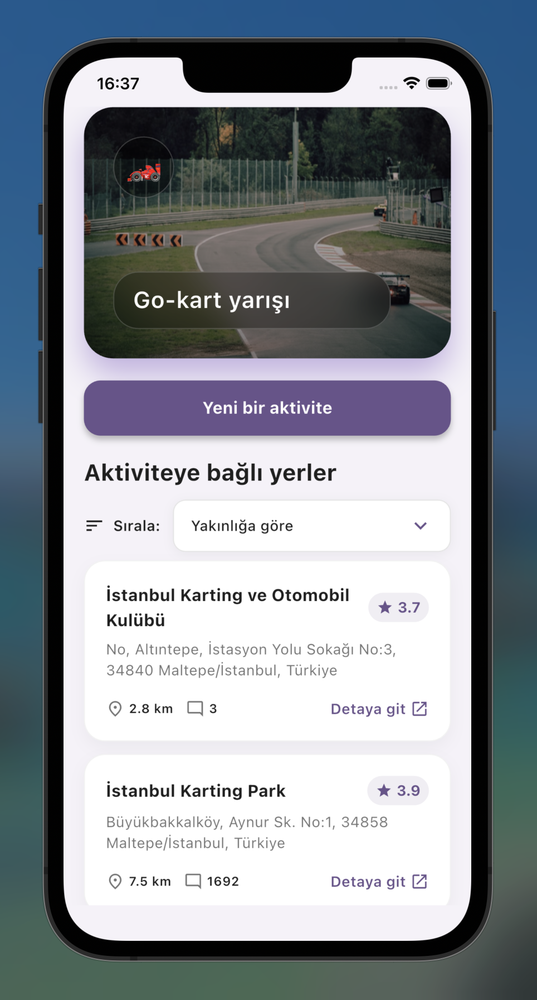

# Ne Yapsak?



Ne Yapsak?, bulunduğunuz konuma yakın yapılacak aktiviteleri hızlıca gösteren basit bir Flutter uygulaması. Bir dokunuşla öneri alır, beğendiğiniz aktiviteyi seçer ve Google Maps üzerinden detaylara gidebilirsiniz.

## Nasıl Çalışır?

- Uygulamayı açıp konum izni verirsiniz.
- “Ne yapalım?” butonuna bastığınızda rastgele bir aktivite ve yakınınızdaki önerileri görürsünüz.
- İstediğiniz kartı seçerek yerin detaylarını haritada açabilirsiniz.

## Proje Yapısı

```
lib/
├── core/         # Tema ve sabitler
├── features/     # Aktiviteler, konum, ses vb.
└── main.dart     # Uygulama başlangıcı
```

## Hızlı Başlangıç

```bash
git clone https://github.com/kullaniciadi/what_to_do_app.git
cd what_to_do_app
flutter pub get
flutter run --dart-define=GOOGLE_MAPS_API_KEY=YOUR_KEY --dart-define=UNSPLASH_API_KEY=YOUR_KEY
```

Unsplash key opsiyoneldir ama görselleri açmak için önerilir. API anahtarlarını `.env` veya CI değişkenleriyle saklamayı unutmayın.

## API Key Nasıl Alınır?

- **Google Maps:** [Google Cloud Console](https://console.cloud.google.com/) → yeni proje → Maps & Places API’lerini etkinleştir → API Key oluştur.
- **Unsplash:** [Unsplash Developers](https://unsplash.com/developers) → yeni uygulama oluştur → Access Key’i kopyala.
