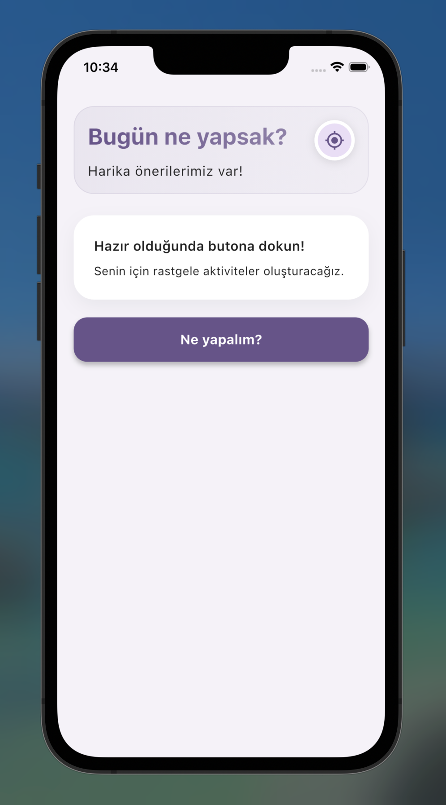
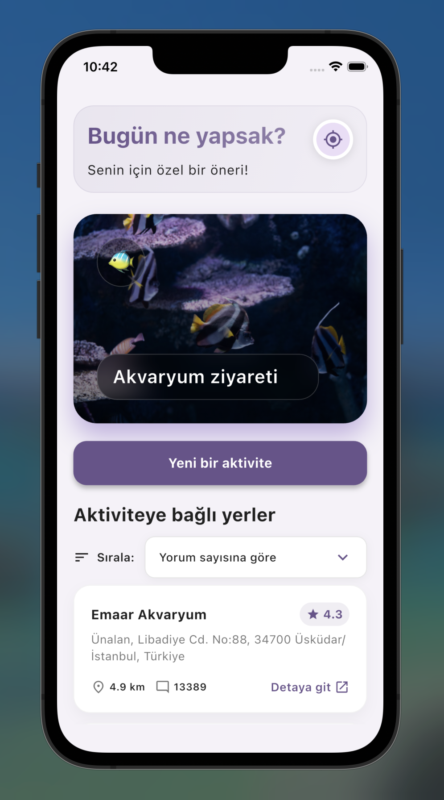
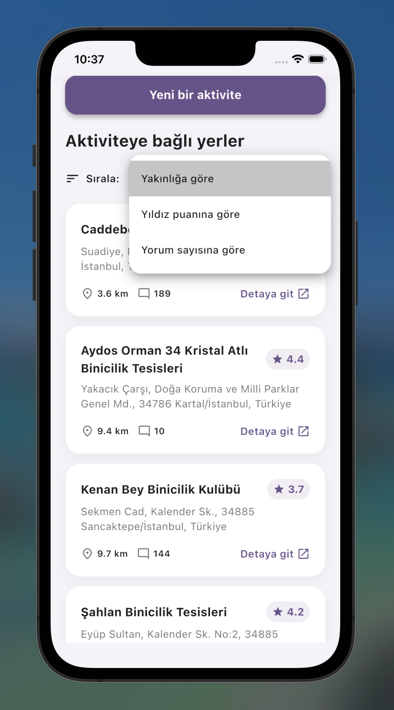

[](https://github.com/XeldarAlz)
[](LICENSE)
[](https://flutter.dev/)
[]()
[](https://github.com/sponsors/XeldarAlz)

> **Dil**: [English](README.md) | [Türkçe](README_TR.md)

# Ne Yapsak?

Bulunduğunuz konuma yakın yapılacak aktiviteleri hızlıca gösteren basit bir Flutter uygulaması. Konum izni verdikten sonra tek dokunuşla rastgele bir aktivite, motivasyon mesajı, görsel ve bu aktiviteyle ilgili yakın yer önerileri görürsünüz.

Uygulama, `location`, `activities`, `places`, `home` ve `audio` gibi feature odaklı paketlere ayrılmıştır ve Google Maps / Places API ile çalışır.

  

## Özellikler

- **Rastgele aktivite üretme**:  
  Konumunu aldıktan sonra "Ne yapalım?" butonuyla rastgele aktivite, mesaj ve görsel üretir.

- **Yakın yer önerileri**:  
  Seçilen aktiviteye uygun, yakın çevredeki mekanlar Google Places üzerinden çekilir.

- **Sıralama ve sayfalama**:  
  Yer sonuçları mesafeye göre sıralanır, parça parça (sayfalama) gösterilir ve istenirse daha fazla sonuç yüklenir.

- **Zengin görsel deneyim**:  
  Aktivite kartları animasyonlar, gradientler ve konfeti efektiyle desteklenir; Unsplash üzerinden görseller alınabilir.

- **Geri bildirim ve ses efektleri**:  
  Başarılı sonuçlarda hafif titreşim, konfeti ve yıldız sesi ile kullanıcıya geri bildirim verilir.

## Mimarinin Genel Yapısı

Proje, `lib/` altında feature-first yaklaşımına yakın bir şekilde yapılandırılmıştır:

- **`core/`**
  - Ortak sabitler (`app_constants.dart`)
  - Tema tanımı (`app_theme.dart`)
  - Ortak exports (`core.dart`)

- **`features/activities/`**
  - `models/activity.dart`: Aktivite modeli
  - `data/activity_repository.dart`: Aktivite listesini ve kategorilerini yönetir
  - `data/message_repository.dart`: Aktiviteye eşlik eden mesajları üretir
  - `data/unsplash_service.dart`: Aktivitelere uygun rastgele görselleri Unsplash API üzerinden çeker

- **`features/location/`**
  - `location_service.dart`:  
    - Konum izinlerini kontrol eder  
    - Kullanıcının mevcut konumunu alır  
    - Hata durumlarında özel `LocationException` fırlatır

- **`features/places/`**
  - `data/places_repository.dart`:  
    - Google Places API üzerinden yakındaki yerleri arar  
    - Yer sonuçlarını projeye özgü modellere dönüştürür
  - `models/place_suggestion.dart`: Yer önerisi modeli
  - `utils/places_sorter.dart`: Yerleri mesafe vb. kriterlere göre sıralar

- **`features/audio/`**
  - `sound_service.dart`: `assets/sounds/star_sparkle.mp3` dosyasını kullanarak başarı sesini çalar
  - `audio.dart`: Feature export dosyası

- **`features/home/`**
  - `presentation/home_page.dart`:  
    - Konum izni isteği  
    - Aktivite üretme akışı  
    - Yer listesinin gösterimi, sıralanması ve "daha fazla" yüklenmesi  
    - Hata mesajlarının gösterimi  
  - `widgets/activity_result_card.dart`: Aktivite kartını gösterir
  - `widgets/place_result_tile.dart`: Yer satırını gösterir
  - `utils/activity_generator.dart`:  
    - Aktivite, mesaj, görsel ve yer sonuçlarını bir arada üreten orkestrasyon sınıfıdır

- **`main.dart` & `app.dart`**
  - `main.dart`: Uygulama giriş noktası
  - `app.dart`:  
    - `MaterialApp` konfigürasyonu  
    - Başlık (`Ne Yapalım?`), tema ve `HomePage` başlangıç ekranı

## API Anahtarları ve Çalıştırma

Uygulama, Google Maps / Places ve isteğe bağlı olarak Unsplash API anahtarları ile çalışır.

- **Google Maps / Places API**: Yakın yer önerileri için kullanılır.
- **Unsplash API** (opsiyonel): Aktivite görselleri için kullanılır.

Geliştirme ortamında uygulamayı şu şekilde çalıştırabilirsiniz:

```bash
flutter pub get
flutter run \
  --dart-define=GOOGLE_MAPS_API_KEY=YOUR_GOOGLE_MAPS_KEY \
  --dart-define=UNSPLASH_API_KEY=YOUR_UNSPLASH_KEY
```

Unsplash anahtarı opsiyoneldir ancak görsel deneyimi zenginleştirmek için önerilir.  
API anahtarlarını `.env` benzeri ortam değişkenleri veya CI ayarlarıyla güvenli bir şekilde yönetmeyi unutmayın.

## Teknolojiler

- **Flutter** (Material 3 temasına yakın, özelleştirilmiş)
- **geolocator**: Konum izni ve koordinat alma
- **url_launcher**: Google Maps üzerinden mekanları açma
- **confetti**: Konfeti animasyonu
- **audioplayers**: Başarı sesleri

## Lisans

Bu proje, **Ticari Olmayan Lisans** altında lisanslanmıştır. Detaylar için [LICENSE](LICENSE) dosyasına bakın.

**Yalnızca Ticari Olmayan Kullanım**: Bu yazılım ve ilgili dokümantasyon dosyaları (bundan böyle "Yazılım" olarak anılacaktır) yalnızca kişisel, eğitimsel ve ticari olmayan kullanım için sağlanmıştır. Telif hakkı sahibinden açık yazılı izin olmadan bu Yazılımı herhangi bir ticari amaç için kullanamazsınız.

## Sponsors

Bu projeyi faydalı buluyorsanız, desteklemeyi düşünün:

[](https://github.com/sponsors/XeldarAlz)

Desteğiniz bu projenin sürdürülmesine ve geliştirilmesine yardımcı olur.

---

<div align="center">

⭐ Bu repo'yu ilginç buluyorsanız yıldızlayın!

</div>

